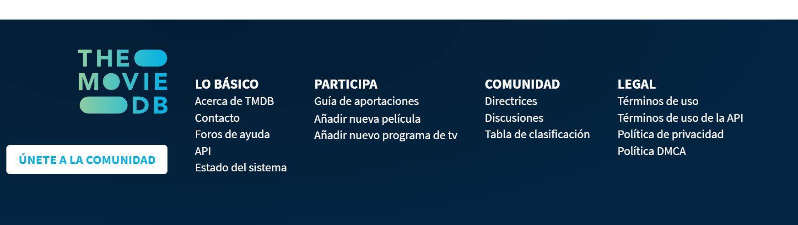
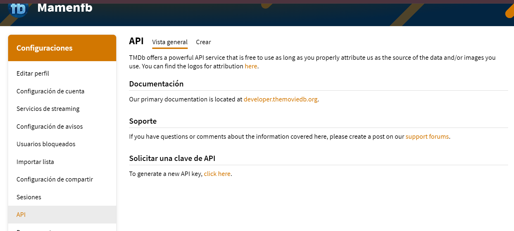

# Sitio de Pelis
 *La API de The Movie Database (TMDb). https://www.themoviedb.org/?language=es
    Enlace a la api 
    
      https://developer.themoviedb.org/docs
    
 *El proyecto está construido con HTML, CSS y JavaScript.

# Contenido del Proyecto
index.html: Este archivo contiene la estructura HTML del sitio, que incluye los elementos básicos de la página, como el contenedor de películas, botones de paginación y referencias a archivos externos.

estilos.css: Este archivo CSS contiene estilos básicos para el diseño del sitio. También incluye la referencia a la fuente de Google Fonts (Montserrat) para mejorar la apariencia del texto.

app.js: Este archivo JavaScript maneja la lógica de paginación y la carga de películas desde la API de TMDb. Utiliza eventos para los botones de "Anterior" y "Siguiente", y realiza solicitudes asíncronas a la API para obtener información sobre películas populares.

# Configuración de la API
Se utiliza la API de TMDb para obtener información sobre películas populares.
La clave de API se encuentra en la URL de la solicitud 

